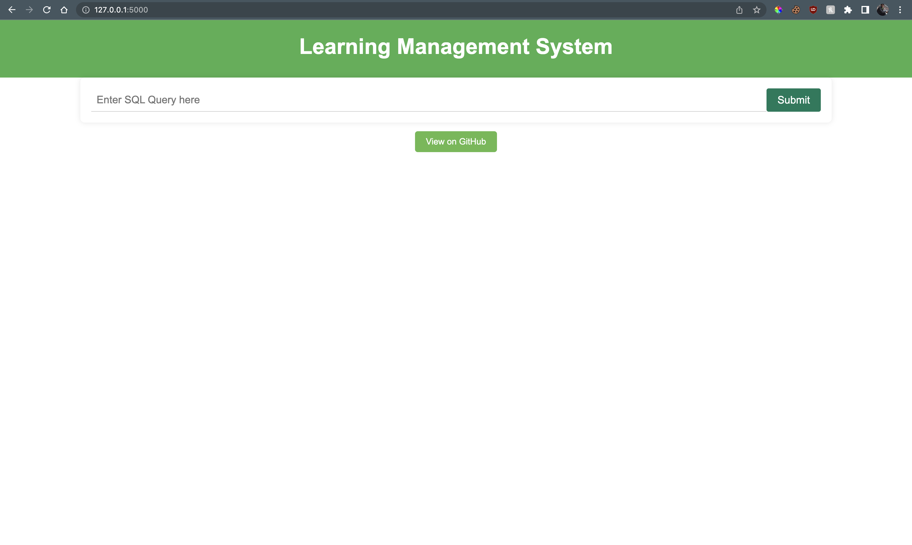
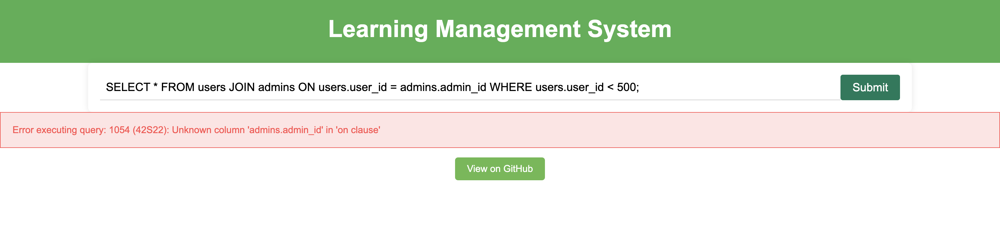
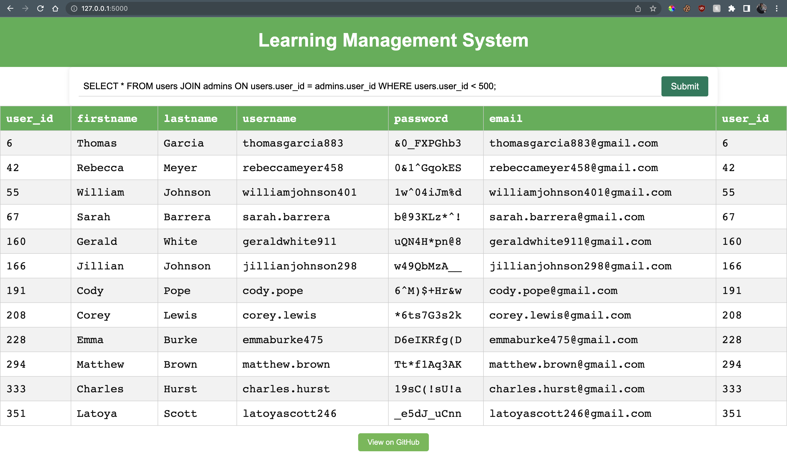

# Learning Management System Database
By Sashank Neupane and Ayazhan Gabitskyzy

---
This is a MySQL database for learning management systems. It includes tables for `users`, `students`, `professors`, `admins`, `majors`, `departments`, `courses`, `enrollments`, `grades`, and `assignments`.

## About the Data

The file `generateData.py` is used to generate the data for this database. All the data is stored in the `./data` folder as csv files.

- `users.csv` is generated using the `faker` library.
- `courses.json` and `departments_and_majors.json` is generated using ChatGPT.
- all other csv files are generated using these two files.
- data generation happens automatically when you populate the tables by running `populateTables.py` script.


## Requirements

To use this database, you'll only need `MySQL` installed on your computer. You can download it from [here](https://dev.mysql.com/downloads/mysql/).


## Installation

To install this database, follow these steps:
1. Clone/download this repository: `git clone https://github.com/sashankneupane7/mysql-lms.git`.
2. Navigate to the repository directory: `cd mysql-lms`.
3. Login to MySQL: `mysql -u <username> -p`.
4. Run the SQL file: `SOURCE ./sql/createFullDB.sql`. This will populate the database with the data from the csv files.
5. If you only want to create database and tables, run: `SOURCE ./sql/createDB.sql`.
6. This will create a database named `lms` and all the tables with exisiting data in the sql files generated from the csv files. If you want to generate new data, you can use the python scripts as described below.

## To create the database and tables using python scripts, follow these steps:

1. Clone/download this repository: `git clone https://github.com/sashankneupane7/mysql-lms.git`.
2. Navigate to the repository directory: `cd mysql-lms`.
3. Update `username` and `password` in the `config.yaml` file.
3. Install required packages: `pip3 install -r python/requirements.txt`
3. Run following commands:
```
python3 python/createDB.py
python3 python/createTables.py
python3 python/populateTables.py
```

## Usage

You can now use this database in your application by connecting to the `lms` database and query data from the tables.


## Web app

We have also created a Flask web app for this database. You can run a flask server by running the following command:
```
pip3 install -r python/requirements.txt
flask run
```
The web app will be available at `http://127.0.0.1:5000`.

---
Index page:


---
Error handling:


---
Results page:

